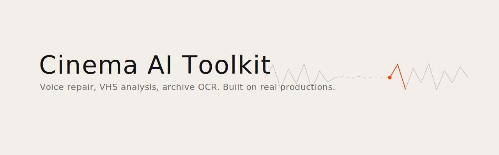
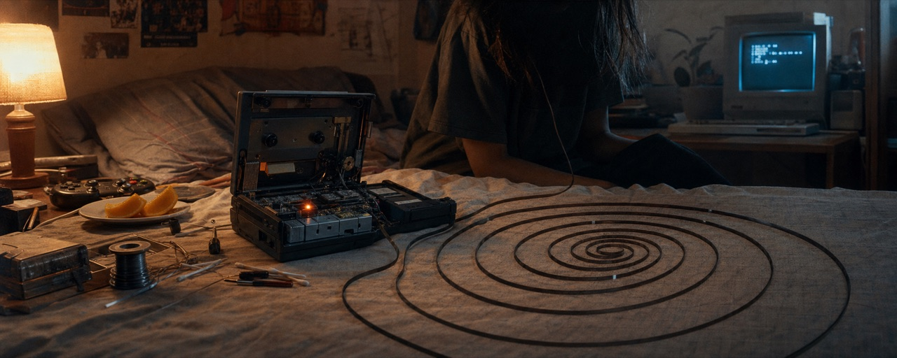

<picture><source media="(prefers-color-scheme: dark)" srcset="banner.svg"></picture>

[English](README.md) · **Français**

# Cinema AI Toolkit

**Boîte à outils IA du cinéaste documentaire : réparation de voix, analyse VHS, workflows FCP, OCR pour documents manuscrits.**

Construite pour de vraies productions, pas des démos.



[](LICENSE.md)


---

## Auteur

[Ismaël Joffroy Chandoutis](https://ismaeljoffroychandoutis.com), cinéaste et artiste. **César 2022**, Cannes, IDFA, Hot Docs, Ars Electronica.

Ces outils ont été construits pendant la production active de longs métrages documentaires. Ils résolvent des problèmes que je rencontre réellement.

---

## Contenu

Quatre outils indépendants, un seul dépôt. Chacun a son propre README avec la documentation complète.

```
cinema-ai-toolkit/
├── voice-pipeline/    # Réparation de voix pour sujets documentaires
├── vhs-pipeline/      # Analyse VHS/Hi8/miniDV avec un LLM de vision → marqueurs FCP
├── fcp-workflow/      # Workflow d'auteur Final Cut Pro + intégration scripting agentique
├── prison-writing/    # OCR + analyse graphologique de documents manuscrits
└── ETHICS.md          # Déclaration éthique pour les outils IA documentaires
```

---

## Outils

### [Voice Pipeline](voice-pipeline/)

Direction de voix pour cinéastes documentaires travaillant avec des sujets non professionnels. La voix du sujet est authentique et irremplaçable : ce pipeline répare la performance, pas la voix.

```
ENREGISTREMENTS BRUTS → Débruitage → Isolation → Diarisation → Segmentation → Normalisation
                          → Amélioration → Inpainting → Correction du débit → Prêt pour clonage vocal
```

**Stack :** DeepFilterNet 3, Resemble Enhance, ElevenLabs, Sesame CSM, Chatterbox

---

### [VHS Pipeline](vhs-pipeline/)

Analyse des heures d'archives analogiques (VHS, Hi8, miniDV, Super8) avec un LLM de vision. Exporte des marqueurs colorés directement vers Final Cut Pro 12.

```
Images d'archive → proxy ffmpeg → analyse par LLM de vision → marqueurs colorés FCPXML → FCP 12
```

| Couleur du marqueur | Signification |
|------|---------|
| Rouge | Intérêt fort, à revoir absolument |
| Orange | Moment de structure narrative |
| Bleu | Marqueur standard |
| Vert | Glitch / artefact |

**Stack :** LLM de vision (rapide), ffmpeg, FCPXML

---

### [FCP Workflow](fcp-workflow/)

Workflow de bout en bout pour le cinéma d'auteur avec Final Cut Pro, scripting agentique et des outils open source.

**Philosophie :** tout détourner. Local d'abord. Le texte brut est roi. Automatiser les tâches fastidieuses.

---

### [Prison Writing Analyzer](prison-writing/)

OCR + analyse graphologique + extraction de données à partir de photographies de documents manuscrits et de correspondance carcérale. Construit pour la recherche documentaire.

Pour chaque image :
1. **Transcription** : OCR mot à mot avec marqueurs d'illisibilité
2. **Classification** : lettre, email de prison, rapport psychiatrique, document juridique...
3. **Analyse graphologique** : pression, inclinaison, régularité, lisibilité
4. **Extraction de données** : personnes, lieux, dates, thèmes, état émotionnel

**Stack :** LLM de vision rapide (principal) + LLM de vision haut de gamme (revérification en cas de faible confiance)

| Modèle | Précision manuscrite | Coût |
|-------|---------------------|------|
| LLM de vision (rapide) | ~90% | 0,50$/1M tokens |
| GPT-5 | ~90%+ | $$$ |
| Tesseract (local) | ~64% | Gratuit |

---

## Éthique

Tous les outils de ce dépôt suivent la déclaration éthique dans [ETHICS.md](ETHICS.md). Les outils IA documentaires opèrent sur de vraies vies. La technologie n'est jamais neutre.

---

## Installation

Chaque outil a ses propres dépendances. Voir le README de chaque dossier.

```bash
# Voice pipeline
cd voice-pipeline && pip install -r requirements.txt

# VHS pipeline
cd vhs-pipeline && pip install -r requirements.txt
```

---

**Consolidé à partir de :** cinema-voice-pipeline · vhs-ai-pipeline · [fcp-auteur-workflow](https://github.com/ismael-joffroy-chandoutis/fcp-auteur-workflow) · prison-writing-analyzer
